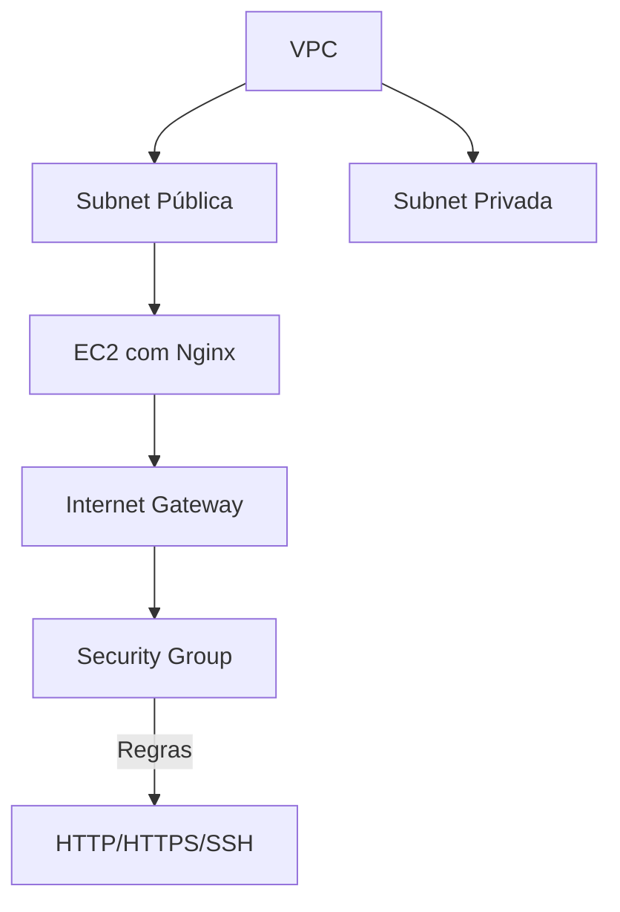

# **MONITORANDO UM SERVIDOR WEB: GUIA PRÁTICO** 
*Um passo a passo visual para criação e automação de infraestrutura na AWS com notificações inteligentes.*

<br>

## ÍNDICE
| Seção | Descrição |  
|-------|-----------|
| [🎯 Objetivos](#objetivos) | Metas do projeto |  
| [🛠 Recursos Necessários](#recursos-necessários) | Pré-requisitos e configurações |  
| [🌐 Configuração AWS](#configurando-o-ambiente-aws) | VPC, Security Groups e EC2 |  
| [🔌 Conexão com a Instância](#conectando-se-à-instância) | Acesso SSH passo a passo |  
| [⚙️ Servidor Web](#configuração-do-servidor-web) | Instalação do Nginx e testes |  
| [🚨 Monitoramento](#monitoramento-e-notificações) | Scripts + Notificações no Telegram |  
| [🤖 Automação](#automatização-com-user-data) | User Data para deploy rápido |  
| [📚 Recursos Úteis](#recursos-úteis) | Scripts prontos e comandos-chave |

---

<br>

# OBJETIVOS
Este projeto tem como objetivo configurar um servidor web na AWS com monitoramento automático. Ele inclui:
- Criação de uma **VPC** com sub-redes públicas e privadas.
- Configuração de uma **instância EC2** e instalação do **Nginx**.
- Criação de uma **página HTML** para testes.
- Implementação de um **script de monitoramento** com envio de notificação para o **Telegram**.
- Implementação de um **script de testes** para verificar todas as configurações e cenários.
- Opção de **automatização** com **User Data**.

**Tecnologias Utilizadas:**  
| AWS Services | Outras Ferramentas |  
|--------------|--------------------|  
| EC2        | Nginx            |  
| VPC        | Shell Script     |  
| Security Groups | Cron         |  

<br>

[⬆️ Índice](#índice)

---

<br>

# RECURSOS NECESSÁRIOS
## Checklist Inicial
✔️ Conta AWS ativa ([Criar conta gratuita](https://aws.amazon.com/pt/free/))

> A [Amazon Web Services (AWS)](https://aws.amazon.com/pt/what-is-aws/) é a plataforma de nuvem mais adotada e mais abrangente do mundo, oferecendo mais de 200 serviços completos de datacenters em todo o mundo. Milhões de clientes, incluindo as startups que crescem mais rápido, as maiores empresas e os maiores órgãos governamentais, estão usando a AWS para reduzir custos, ganhar agilidade e inovar mais rapidamente.

✔️ Terminal com acesso SSH (Linux/Mac/WSL)

✔️ Conta no Telegram (para notificações)


Agora, precisamos configurar nosso setup para que este se conecte com a instância AWS. Ainda, precisamos configurar todo o processo de webhook com o Telegram.  

<br>

## Configurando o AWS CLI
Basicamente, iremos nos conectar à instância através do terminal, via linha de comando. Para isto, iremos configurar o **AWS CLI** em nosso setup. [Clique aqui](https://docs.aws.amazon.com/cli/latest/userguide/cli-chap-getting-started.html) para acessar a documentação oficial, com um passo a passo detalhado para a instalação e configuração.

<br>

## Configurando o Webhook no Telegram
### **Passo 1: Criar o Bot**
1. No Telegram, procure por `@BotFather`.
2. Inicie uma conversa e envie o comando `/newbot`.
3. O BotFather pedirá um nome para o bot (exemplo: `MonitoramentoBot`).
4. Em seguida, pedirá um nome de usuário único, que deve terminar com "bot" (exemplo: `MonitoramentoServer_bot`).
5. Após a criação, o BotFather fornecerá um **Token de API**, que será necessário para enviar mensagens. **Guarde esse token**.

<br>

### **Passo 2: Obter o Chat ID**
Para enviar mensagens, precisamos saber para onde o bot deve enviá-las.
1. Acesse `https://t.me/RawDataBot` no Telegram e inicie uma conversa.
2. Ele fornecerá seu `chat_id`. **Guarde essa informação**

<br>

### **Passo 3: Iniciar o Bot**
Para enviar mensagens através do webhook, precisamos "iniciar" nosso bot para que ele reconheça nosso chat_id.
1. No Telegram, procure por `@MonitoramentoBot` (use o nome que você deu ao bot.
2. Inicie uma conversa enviando o comando `/start.

<br>

[⬆️ Índice](#índice)

---

<br>

# **CONFIGURANDO O AMBIENTE AWS**
### **Arquitetura Proposta**  



## **Criar a VPC**
Agora vamos criar uma VPC na AWS com 4 sub-redes (2 privadas e 2 públicas), com um internet gateway conectado à uma das sub-redes públicas.

- Após logar no console AWS, selecione VPC (ou digite na barra de busca).


- Clique em *Create VPC*


- Aplique as configurações abaixo e clique em *Create VPC*<br>


- Se as configurações estiverem corretas, o fluxo ser similar à esse:


[⬆️](#índice)
<br>

## **Criando um Security Group**
- No dashboard, clique em EC2. Depois, na seção à esquerda, selecione *Secuity Group*


- Clique em *Create Security Group*


- Aplique as configurações abaixo e clique em *Create Security Group*


[⬆️](#índice)

<br>

## **Criar a instância EC2**
- Em EC2, na seção à esquerda, clique em *Instances* e depois em "Launch Instances"


- Aplique as configurações abaixo:


- Para criar um "Key Pair", faça:<br>


Após a criação, a chave será baixada automaticamente para sua máquina. É importante mantê-la disponível no momento da conexão com a instância. Se estiver usando o windows, com wsl, utilize o comando abaixo para copiar para a máquina Linux. Se já estiver utilizando Linux, pule esta etapa.
```cmd
scp \caminho_para_chave\[SUA_CHAVE].pem [USUÁRIO]@[IP_LINUX]:/home/[USUÁRIO]
```

- Já no linux, aplique as permissões para a chave:
```bash
chmod 400 [SUA_CHAVE].pem
```

- Continue as configurações:<br>


- Revise as configurações e clique em *Launch Instance* <br>


[⬆️](#índice)

<br>

# **CONECTANDO-SE À INSTÂNCIA**
Agora é o momento de testar se todas as configurações foram aplicadas corretamente.

- No console AWS, ao selecionar sua instância, todas as informações sobre ela são exibidas <br>


- Verififique se o status da instância aparece como ***running*** <br>
.png)

- Agora, no seu terminal linux, utilize o comando abaixo:
```bash
ssh -i /local/da/chave/privada/[SUA_CHAVE].pem [USUÁRIO_EC2]@ip_publico
```

> Você também pode acessa esse comando pelo console AWS, clicando em ***connect*** e depois em ***SSH Client*** <br>
>  <br>
> 

- Será solicitado a confirmação de acesso. Digite `yes` e aperte enter. Se tudo ocorrer como esperado, você estará conectado à instância EC2

[⬆️](#índice)
<br>

# **CONFIGURAÇÃO DO SERVIDOR WEB**
## **Instalar o e iniciar o Nginx**
No seu terminal, digite os seguintes comandos:
```bash
sudo apt-get update -y
sudo apt-get install -y nginx
sudo systemctl start nginx
sudo systemctl enable nginx
```
[⬆️](#índice)

<br>

## **Criar a Página HTML**
Agora, vamos usar o editor Nano para criar a página HTML exibida ao acessar o servidor. Digite no terminal:

```bash
sudo nano /var/www/html/index.html
```

Adicione o conteúdo de sua página ao editor. Abaixo, temos um exemplo de página básica.

> No repósitorio há um diretório com a página criada para este projeto, utilizando bootstrap, CSS e Javascript. Se desejar, o script [user_data.sh](https://github.com/vinicius-emanuelds/servidor-web-monitorado/blob/b8e673efc0ee6ce41d9ea324c414e45d1dfdb765/src/scripts/user_data.sh) está configurado para realizar todas as configurações necessárias para exibir uma página mais robusta.

```html
<!DOCTYPE html>
<html>
<head><title>Servidor Web</title></head>
<body>
    <h1>Servidor Web configurado!</h1>
</body>
</html>
```
Para salvar as alterações do Nano, digte `Ctrl + x`, `y` e aperte `enter`.

[⬆️](#índice)

<br>

## **Testar o Servidor**
Agora, acesse um navegador e coloque o IP público da instância.

> O IP público da instância pode ser encontrado no console ASW: <br
> 

Se tudo estiver configurado corretamente, você deverá visualizar a página. <br>


[⬆️](#índice)

<br>

# **MONITORAMENTO E NOTIFICAÇÕES**
## **Criar o Script de Monitoramento**
Agora, vamos configurar o monitoramento do servidor através de um shell script.

No terminal, digite:
```bash
sudo nano /home/[USUÁRIO]/monitoramento.sh
```

Adicione no editor:
```bash
#!/usr/bin/env bash

LOCKFILE="/tmp/monitorar.lock"
LOGS="/var/log/monitorar.log"
BOT_TOKEN="[COLE AQUI O TOKEN GERADO PELO BOT]"
CHAT_ID="[COLE SEU CHAT_ID]"

exec 200>"$LOCKFILE"
if ! flock -n 200; then
    echo "O script já está em execução. Abortando."
    exit 1
fi

trap 'rm -f "$LOCKFILE"' EXIT

touch "$LOCKFILE"

if [ ! -f "$LOGS" ]; then
    touch "$LOGS"
fi

enviar_alerta() {
    local MENSAGEM="$1"
    curl -s -X POST "https://api.telegram.org/bot$BOT_TOKEN/sendMessage" \
        -d "chat_id=$CHAT_ID" \
        -d "text=$MENSAGEM" > /dev/null 2>&1
}

STATUS=$(curl -s -o /dev/null -w "%{http_code}" http://localhost)
TIME=$(date "+%d-%m-%Y %H:%M:%S")

case $STATUS in
    200)
        echo "$TIME - ✅ Site online!" >> "$LOGS"
        ;;
    400)
        MENSAGEM="$TIME - 🚨 ERRO 400: Requisição inválida!"
        echo "$MENSAGEM" >> "$LOGS"
        enviar_alerta "$MENSAGEM"
        ;;
    401)
        MENSAGEM="$TIME - 🚨 ERRO 401: Não autorizado!"
        echo "$MENSAGEM" >> "$LOGS"
        enviar_alerta "$MENSAGEM"
        ;;
    403)
        MENSAGEM="$TIME - 🚨 ERRO 403: Acesso proibido!"
        echo "$MENSAGEM" >> "$LOGS"
        enviar_alerta "$MENSAGEM"
        ;;
    404)
        MENSAGEM="$TIME - 🚨 ERRO 404: Página não encontrada!"
        echo "$MENSAGEM" >> "$LOGS"
        enviar_alerta "$MENSAGEM"
        ;;
    408)
        MENSAGEM="$TIME - 🚨 ERRO 408: Tempo limite da requisição!"
        echo "$MENSAGEM" >> "$LOGS"
        enviar_alerta "$MENSAGEM"
        ;;
    429)
        MENSAGEM="$TIME - 🚨 ERRO 429: Muitas requisições!"
        echo "$MENSAGEM" >> "$LOGS"
        enviar_alerta "$MENSAGEM"
        ;;
    500)
        MENSAGEM="$TIME - 🚨 ERRO 500: Erro interno do servidor!"
        echo "$MENSAGEM" >> "$LOGS"
        enviar_alerta "$MENSAGEM"
        ;;
    502)
        MENSAGEM="$TIME - 🚨 ERRO 502: Gateway inválido!"
        echo "$MENSAGEM" >> "$LOGS"
        enviar_alerta "$MENSAGEM"
        ;;
    503)
        MENSAGEM="$TIME - 🚨 ERRO 503: Serviço indisponível!"
        echo "$MENSAGEM" >> "$LOGS"
        enviar_alerta "$MENSAGEM"
        ;;
    504)
        MENSAGEM="$TIME - 🚨 ERRO 504: Tempo limite do gateway!"
        echo "$MENSAGEM" >> "$LOGS"
        enviar_alerta "$MENSAGEM"
        ;;
    *)
        MENSAGEM="$TIME - 🚨 ERRO $STATUS: Servidor offline!"
        echo "$MENSAGEM" >> "$LOGS"
        enviar_alerta "$MENSAGEM"
        ;;
esac

rm -f "$LOCKFILE"
```

Agora, iremos alterar as permissões do arquivo para que ele possa ser executado:
```bash
sudo chmod +x /home/[USUÁRIO]/monitoramento.sh
```
[⬆️](#índice)

<br>

## **Automatizar a Execução com Cron**
Agora vamos automatizar a execução do script com o Cron.<br>

Primeriro, crie o arquivo de logs:
~~~bash    
sudo touch /var/log/monitoramento/cron_monitor.log
sudo chmod 666 /var/log/monitoramento/cron_monitor.log
~~~

Agora, no terminal, digite:
```bash
sudo crontab -e
```

Escolha uma das 4 opções de editor. Depois, adicione ao final do arquivo:
```bash
*/1 * * * * echo \"\$(date '+\%d-\%m-\%Y \%H:\%M:\%S') - Executando monitorar.sh\" >> /var/log/monitoramento/cron_monitor.log && /home/usuario/monitorar.sh >> /var/log/monitoramento/cron_monitor.log 2>&1"
```
Salve o arquivo. Dessa forma, o script irá verificar, a cada minuto, se o servidor está online. Caso ele esteja offline, uma notificação será encaminhado ao Telegram.

[⬆️](#índice)
<br>


# **TESTES**
## **Testar a Implementação**
- Acesse `http://IP_DA_INSTANCIA` para verificar o site.

- Pare o Nginx e aguarde 1 minuto:
    ```bash
    sudo systemctl stop nginx
    ```

- Verifique os logs:
    ```bash
    tail -f /var/log/monitoramento/monitoramento.log
    tail -f /var/log/monitoramento/cron_monitor.log
    ```

- Confirme no Telegram o recebimento das notificações.

- Reinicie o Nginx:
    ```bash
    sudo systemctl start nginx
    ```

Você também pode automatizar o teste criando um script. Para isso, no terminal, digite:

```bash
sudo nano /home/[USUÁRIO]/nginx_status.sh
```

Adicione no editor:
```bash
#!/usr/bin/env bash

# Verifica o status do serviço nginx
STATUS=$(systemctl is-active nginx)

if [ "$STATUS" == "active" ]; then
    # Se o nginx está ativo, então desativa
    echo "O serviço nginx está ativo. Desativando..."
    sudo systemctl stop nginx
else
    # Se o nginx está inativo, então ativa
    echo "O serviço nginx está inativo. Ativando..."
    sudo systemctl start nginx
fi
```

Altere as permissões do arquivo para que ele possa ser executado:
```bash
sudo chmod +x /home/[USUÁRIO]/nginx_status.sh
```

crie o arquivo de logs:
~~~bash    
sudo touch /var/log/monitoramento/nginx_status.log
sudo chmod 666 /var/log/monitoramento/nginx_status.log
~~~

Vamos automatizar a execução:
```bash
sudo crontab -e
```

Adicione ao final do arquivo:
```bash
*/1 * * * * /home/usuario/nginx_status.sh >> /var/log/monitoramento/nginx_status.log 2>&1
```

<p>Salve o arquivo. Dessa forma, o script irá verificar, a cada  minutos, se o nginx está ativo. Caso ele esteja inativo, ele irá ativar. Se ele estiver ativo, ele irá desativar. Para parar a execução, edite o arquivo cron e exclua a linha referente ao script.</p>

### Cronologia de execução


> Os horários no registro de log seguem o fuso horário do servidor alocado (us-east-1), então ele registra com +3h em relação ao horário local

No exemplo da imagem, o `monitorar.sh` foi executado às 09:59:01, acusando que o servidor estava online. O script `nginx_status.sh`também foi executado às 09:59:01, mas imediatamente após o script `monitorar.sh`, seguindo a ordem de inserção no arquivo `crontab`. Dessa forma, ao acessar o site pelo ip público, não foi possível conectar: <br>


Da mesma forma, às 10:00:01, os scripts foram executados novamente e o site ficou disponível: <br>


Podemos verificar também que o envio de mensagem ao Telegram funciona corretamente, registrando a cada 2 minutos a indisponibilidade do servidor. <br>


[⬆️](#índice)


# **Automatização com User Data**
Uma outra forma de fazer as configurações da instância é a utilização de *User Data* no momento da criação da instância.
Para isso, siga a [Etapa 1](#etapa-1-configuração-do-ambiente), mas, antes de lançar a instância, faça a seguinte configuração:

- Expanda as configurações avançadas:<br>


- Role até o final da pagina e encontre o campo *User Data*:<br>


- Adicione este script no campo **"User Data"** ao criar a EC2:
```bash
#!/usr/bin/env bash

# Configuração Inicial
# Esse script é executado no primeiro boot da instância EC2 (Ubuntu Server)
# Ele configura o servidor e instala o Nginx

# Atualiza a lista de pacotes do sistema e instala o Nginx
sudo apt update -y && sudo apt install nginx -y

# Criação da página HTML para o servidor Nginx
sudo cat << 'EOF' > /var/www/html/index.html
<!DOCTYPE html>
<html>
<head><title>Servidor Web</title></head>
<body>
    <h1>Servidor Web configurado!</h1>
</body>
</html>
EOF

# Habilita e inicia o serviço do Nginx
sudo systemctl enable nginx --now

# Criação do Script de Monitoramento
MONITOR_SCRIPT="/home/usuario/monitorar.sh"
LOG_DIR="/var/log/monitoramento"
mkdir -p $LOG_DIR

# Definindo as variáveis de log corretamente
LOGS="$LOG_DIR/monitorar.log"
LOGS_CRON="$LOG_DIR/cron_monitor.log"
LOGS_STATUS="$LOG_DIR/nginx_status.log"

# Verifica se os arquivos de log existem e os cria, se necessário
if [ ! -f "$LOGS" ]; then
    sudo touch "$LOGS"
    sudo chmod 666 "$LOGS"
fi

if [ ! -f "$LOGS_CRON" ]; then
    sudo touch "$LOGS_CRON"
    sudo chmod 666 "$LOGS_CRON"
fi

if [ ! -f "$LOGS_STATUS" ]; then
    sudo touch "$LOGS_STATUS"
    sudo chmod 666 "$LOGS_STATUS"
fi

sudo cat << 'EOF' > $MONITOR_SCRIPT
#!/usr/bin/env bash

LOCKFILE="/tmp/monitorar.lock"
LOGS="/var/log/monitorar.log"
BOT_TOKEN="[COLE AQUI O TOKEN GERADO PELO BOT]"
CHAT_ID="[COLE SEU CHAT_ID]"

exec 200>"$LOCKFILE"
if ! flock -n 200; then
    echo "O script já está em execução. Abortando."
    exit 1
fi

trap 'rm -f "$LOCKFILE"' EXIT

touch "$LOCKFILE"

if [ ! -f "$LOGS" ]; then
    touch "$LOGS"
fi

enviar_alerta() {
    local MENSAGEM="$1"
    curl -s -X POST "https://api.telegram.org/bot$BOT_TOKEN/sendMessage" \
        -d "chat_id=$CHAT_ID" \
        -d "text=$MENSAGEM" > /dev/null 2>&1
}

STATUS=$(curl -s -o /dev/null -w "%{http_code}" http://localhost)
TIME=$(date "+%d-%m-%Y %H:%M:%S")

case $STATUS in
    200)
        echo "$TIME - ✅ Site online!" >> "$LOGS"
        ;;
    400)
        MENSAGEM="$TIME - 🚨 ERRO 400: Requisição inválida!"
        echo "$MENSAGEM" >> "$LOGS"
        enviar_alerta "$MENSAGEM"
        ;;
    401)
        MENSAGEM="$TIME - 🚨 ERRO 401: Não autorizado!"
        echo "$MENSAGEM" >> "$LOGS"
        enviar_alerta "$MENSAGEM"
        ;;
    403)
        MENSAGEM="$TIME - 🚨 ERRO 403: Acesso proibido!"
        echo "$MENSAGEM" >> "$LOGS"
        enviar_alerta "$MENSAGEM"
        ;;
    404)
        MENSAGEM="$TIME - 🚨 ERRO 404: Página não encontrada!"
        echo "$MENSAGEM" >> "$LOGS"
        enviar_alerta "$MENSAGEM"
        ;;
    408)
        MENSAGEM="$TIME - 🚨 ERRO 408: Tempo limite da requisição!"
        echo "$MENSAGEM" >> "$LOGS"
        enviar_alerta "$MENSAGEM"
        ;;
    429)
        MENSAGEM="$TIME - 🚨 ERRO 429: Muitas requisições!"
        echo "$MENSAGEM" >> "$LOGS"
        enviar_alerta "$MENSAGEM"
        ;;
    500)
        MENSAGEM="$TIME - 🚨 ERRO 500: Erro interno do servidor!"
        echo "$MENSAGEM" >> "$LOGS"
        enviar_alerta "$MENSAGEM"
        ;;
    502)
        MENSAGEM="$TIME - 🚨 ERRO 502: Gateway inválido!"
        echo "$MENSAGEM" >> "$LOGS"
        enviar_alerta "$MENSAGEM"
        ;;
    503)
        MENSAGEM="$TIME - 🚨 ERRO 503: Serviço indisponível!"
        echo "$MENSAGEM" >> "$LOGS"
        enviar_alerta "$MENSAGEM"
        ;;
    504)
        MENSAGEM="$TIME - 🚨 ERRO 504: Tempo limite do gateway!"
        echo "$MENSAGEM" >> "$LOGS"
        enviar_alerta "$MENSAGEM"
        ;;
    *)
        MENSAGEM="$TIME - 🚨 ERRO $STATUS: Servidor offline!"
        echo "$MENSAGEM" >> "$LOGS"
        enviar_alerta "$MENSAGEM"
        ;;
esac

rm -f "$LOCKFILE"
EOF

# Concede permissão de execução ao script
sudo chmod +x $MONITOR_SCRIPT

# Adiciona o script ao crontab para rodar a cada minuto e registra logs no arquivo dedicado
CRON_JOB="*/1 * * * * echo \"\$(date '+\%d-\%m-\%Y \%H:\%M:\%S') - Executando monitorar.sh\" >> $LOGS_CRON && /home/usuario/monitorar.sh >> $LOGS_CRON 2>&1"
( crontab -l 2>/dev/null; echo "$CRON_JOB" ) | crontab -

# Criação do arquivo de log para o crontab
sudo touch $LOGS_CRON
sudo chmod 666 $LOGS_CRON

# Criação do Script de Status do Nginx
STATUS_SCRIPT="/home/usuario/nginx_status.sh"

sudo cat << 'EOF' > $STATUS_SCRIPT
#!/usr/bin/env bash

# Verifica o status do serviço nginx
STATUS=$(systemctl is-active nginx)
TIME=$(date "+%d-%m-%Y %H:%M:%S")

if [ "$STATUS" == "active" ]; then
    # Se o nginx está ativo, então desativa
    echo "O serviço nginx está ativo. Desativando..."
    sudo systemctl stop nginx
else
    # Se o nginx está inativo, então ativa
    echo "O serviço nginx está inativo. Ativando..."
    sudo systemctl start nginx
fi
EOF

# Torna o script de status executável
sudo chmod +x $STATUS_SCRIPT

# Criação do arquivo de log para o script de status
sudo touch $LOGS_STATUS
sudo chmod 666 $LOGS_STATUS

# Adiciona o script ao crontab para rodar a cada 1 minutos
CRON_STATUS="*/1 * * * * /home/usuario/nginx_status.sh >> $LOGS_STATUS 2>&1"
( crontab -l 2>/dev/null; echo "$CRON_STATUS" ) | crontab -

```

Agora, lance a instância. Não é necessário executar mais nenhuma configuração, apenas conecte-se à instância e acesse os arquivos de log para acompanhar a execução dos scripts.

### ATENÇÃO
> O user data tem um tamanho limite de 16 KB. Caso seu script ultrapasse esse limite, será necessário fazer uma "manobra" para inserirmos o user data com sucesso.
> 
>   1º - Crie um repositório no github com o arquivo `.sh` do user data
> 
>   2º - Para este projeto, é recomendável que o repositório seja privado (para evitar o vazamento de tokens e chat_id), então será necessário gerar um token de acesso. [Clique aqui](https://docs.github.com/en/authentication/keeping-your-account-and-data-secure/managing-your-personal-access-tokens) para acessar a documentação sobre como gerar o token. Lembre de garantir acesso total para leitura e escrita.
> 
>   3º - Agora, insira o script abaixo no campo user data, substuindo suas informações
> ~~~bash
> #!/bin/bash
>   apt-get update -y
>  apt-get install -y git
>  cd /tmp
>  git clone https://[SEU_TOKEN]@github.com/caminho_do/seu_repositorio.git
>  cd [repositório]
>   bash user_data.sh
> ~~~
>
> Agora, lance a instância.

[⬆️](#índice)

---

# **Recursos Úteis**
- [Clique aqui](https://github.com/vinicius-emanuelds/servidor-web-monitorado/blob/b8e673efc0ee6ce41d9ea324c414e45d1dfdb765/Comandos_Utilizados.md) para ver a lista dos comandos mais utilizados nesse projeto. Há uma breve explicação sobre o funcionamento de cada um
- O arquivo [undo.sh](https://github.com/vinicius-emanuelds/servidor-web-monitorado/blob/b8e673efc0ee6ce41d9ea324c414e45d1dfdb765/src/scripts/undo.sh) é um script que "reverte" todas as alterações feitas durante o projeto.
- Todos os scripst utilizados no projeto estão disponíveis em `/src/scripts`.
  
[⬆️](#índice)


# **Conclusão**
Ao longo deste projeto, pude experimentar na prática todo o processo de configuração, monitoramento e automação de um servidor web na AWS. Desde a criação da infraestrutura até a implementação de notificações automáticas, cada etapa foi um aprendizado valioso sobre como tornar a gestão de servidores mais eficiente e confiável.

Mais do que simplesmente montar um ambiente funcional, essa experiência me permitiu aprofundar conhecimentos em redes, segurança, automação e monitoramento. A integração com o Telegram para alertas em tempo real trouxe um nível extra de controle, garantindo que qualquer problema no servidor seja identificado imediatamente.

Os principais aprendizados que levo daqui são:

✅ Como estruturar corretamente uma infraestrutura na AWS, configurando VPCs, sub-redes e instâncias EC2.

✅ A importância da automação com User Data, reduzindo configurações manuais e otimizando o tempo.

✅ A implementação de um sistema de monitoramento ativo, garantindo maior disponibilidade do serviço.

✅ O uso do cron para programar execuções periódicas e automatizar verificações.

✅ Boas práticas de segurança, configurando acessos e permissões corretamente.

Com3 esse conhecimento, posso personalizar ainda mais o projeto e adaptá-lo para diferentes cenários. Sempre há espaço para melhorias e otimizações, e a tecnologia está em constante evolução. O aprendizado não termina aqui—este é apenas mais um passo na jornada.

🚀 ***Agora é hora de seguir explorando e inovando!***
